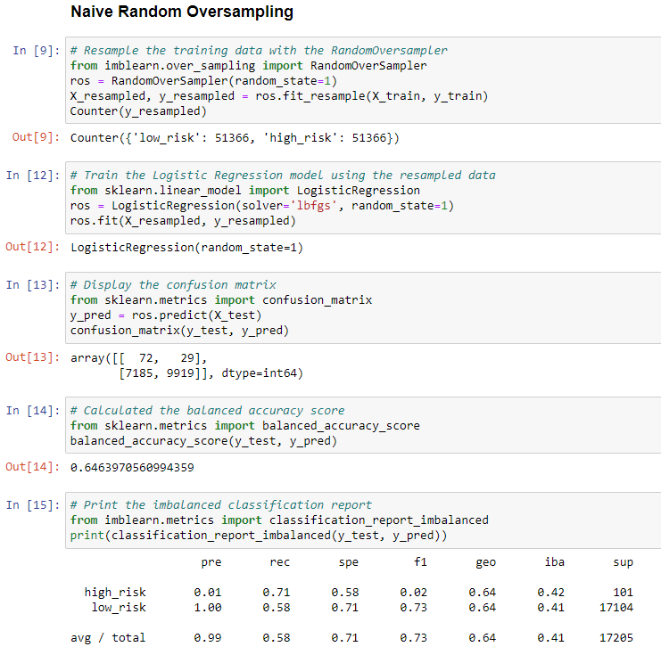
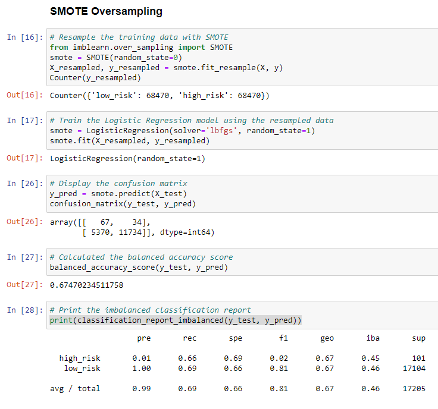
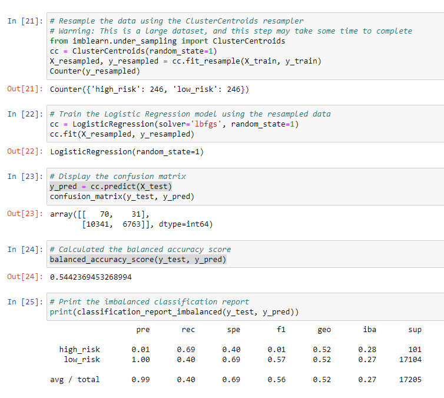
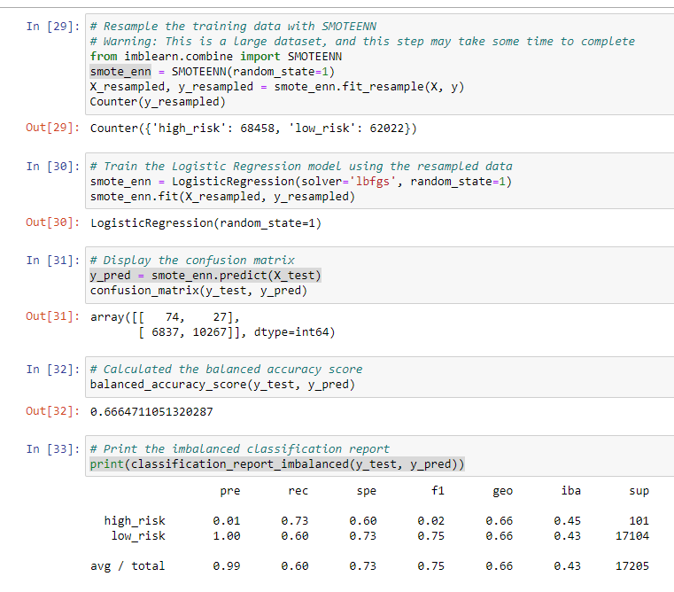
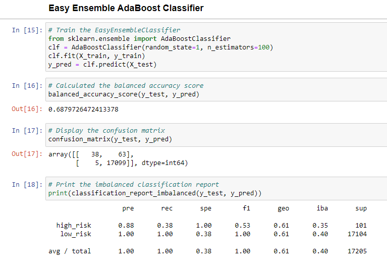

# Credit_Risk_Analysis
## Analysis

Overview of the loan prediction risk analysis:

The purpose of this analysis is well defined 
## Results:
### Oversampling
* Naive Random Oversampling
  * Accuracy Score: 0.646
  * Precision Score: high_risk = 0.01, low_risk = 1.00, avg = 0.99
  * Recall Score: high_risk = 0.71, low_risk = 0.58, avg = 0.58
# 
* SMOTE Oversampling
  * Accuracy Score: 0.675
  * Precision Score: high_risk = 0.01, low_risk = 1.00, avg = 0.99
  * Recall Score: high_risk = 0.66, low_risk = 0.69, avg = 0.69
# 
### Undersampling
* Cluster Centroids Undersampling
  * Accuracy Score: 0.544
  * Precision Score: high_risk = 0.01, low_risk = 1.00, avg = 0.99
  * Recall Score: high_risk = 0.69, low_risk = 0.40, avg = 0.40
# 
### Combination (Over/Under) Sampling
* Smoteenn Combination Sampling
  * Accuracy Score: 0.666
  * Precision Score: high_risk = 0.01, low_risk = 1.00, avg = 0.99
  * Recall Score: high_risk = 0.73, low_risk = 0.60, avg = 0.60
# 
### Ensemble Learners 
* Balanced Random Forest Classifier
  * Accuracy Score: 0.789
  * Precision Score: high_risk = 0.03, low_risk = 1.00, avg = 0.99
  * Recall Score: high_risk = 0.70, low_risk = 0.87, avg = 0.87
# 
* AdaBoost Classifier
  * Accuracy Score: 0.688
  * Precision Score: high_risk = 0.88, low_risk = 1.00, avg = 1.00
  * Recall Score: high_risk = 0.38, low_risk = 1.00, avg = 1.00
# 

There is a bulleted list that describes the balanced accuracy score and the precision and recall scores of all six machine learning models 
## Summary:

There is a summary of the results 
There is a recommendation on which model to use, or there is no recommendation with a justification 
